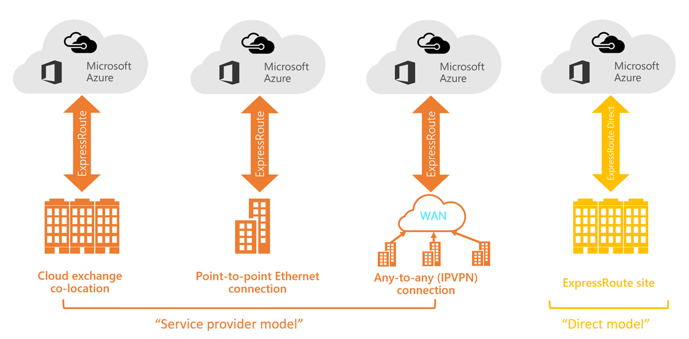
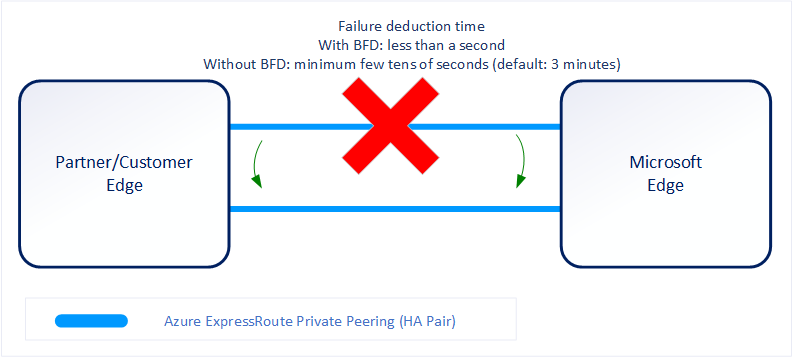
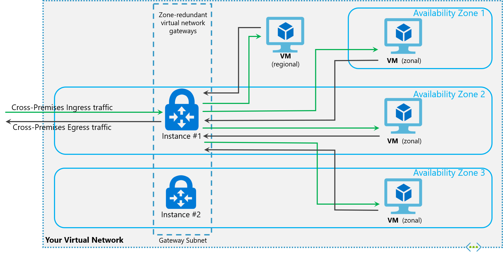
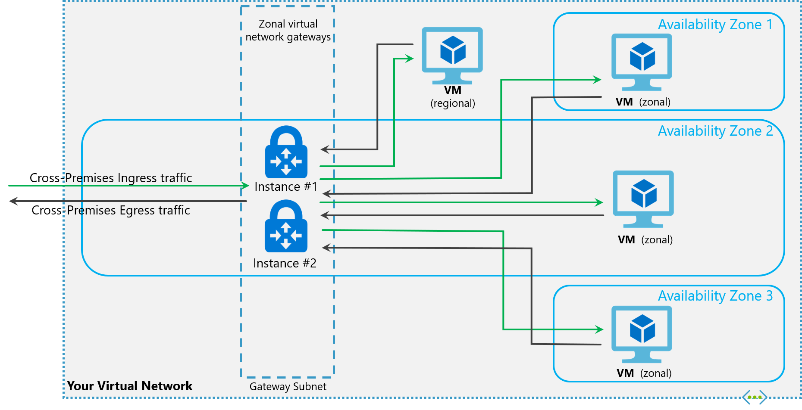

# Azure ExpressRoute

#### ExpressRoute capabilities

* **Layer 3** connectivity between your on-premises network and the Microsoft Cloud through a connectivity provider
* Connectivity can be from an **any-to-any (IPVPN) network**, a **point-to-point** Ethernet connection, or through a **virtual cross-connection via an Ethernet exchange**
* Connectivity to Microsoft cloud services across all regions in the geopolitical region
* Global connectivity to **Microsoft services across all regions** with the **ExpressRoute premium add-on**
* **Built-in redundancy** in every peering location for higher reliability

#### Use cases for Azure ExpressRoute

* Faster and Reliable connection to Azure services
* Storage, backup, and Recovery
* Extends Data center capabilities
* Predictable, reliable, and high-throughput connections

#### ExpressRoute connectivity models

You can create a connection between your on-premises network and the Microsoft cloud in four different ways:

* CloudExchange Co-location
* Point-to-point Ethernet Connection
* Any-to-any (IPVPN) Connection
* ExpressRoute Direct

#### Provider vs direct model (ExpressRoute Direct)

* ExpressRoute Direct
    * ability to connect directly into Microsoft’s global network at peering locations.
    * dual 100 Gbps or 10-Gbps connectivity, which supports Active/Active connectivity
    * Key features:
        * Massive Data Ingestion into services like Storage and Cosmos DB
        * Physical isolation for industries that are regulated and require dedicated and isolated connectivity like: Banking, Government, and Retail
        * Granular control of circuit distribution based on business unit

| ExpressRoute using a Service Provider | ExpressRoute Direct |
|-|-|
| Uses service providers to enable fast onboarding and connectivity into existing infrastructure |	Requires 100 Gbps/10 Gbps infrastructure and full management of all layers |
| Integrates with hundreds of providers including Ethernet and MPLS | Direct/Dedicated capacity for regulated industries and massive data ingestion |
| Circuits SKUs from 50 Mbps to 10 Gbps | Customer may select a combination of the following circuit SKUs on 100-Gbps ExpressRoute Direct:   - 5 Gbps  - 10 Gbps   - 40 Gbps   - 100 Gbps  Customer may select a combination of the following circuit SKUs on 10-Gbps ExpressRoute Direct:   - 1 Gbps   - 2 Gbps   - 5 Gbps   - 10 Gbps |
| Optimized for single tenant |	Optimized for single tenant with multiple business units and multiple work environments|

#### Route advertisement

When Microsoft peering gets configured on your ExpressRoute circuit, the Microsoft Edge routers establish a pair of Border Gateway Protocol (BGP) sessions with your edge routers through your connectivity provider. No routes are advertised to your network. To enable route advertisements to your network, you must associate a route filter.

In order to associate a route filter:

* You must have an active ExpressRoute circuit that has **Microsoft peering provisioned**.
* Create an ExpressRoute circuit and have the circuit enabled by your connectivity provider before you continue. The ExpressRoute **circuit must be in a provisioned and enabled state**.
* Create **Microsoft peering** if you manage the BGP session directly. Or, have your connectivity provider provision Microsoft peering for your circuit.

#### Bidirectional Forwarding Detection

ExpressRoute supports Bidirectional Forwarding Detection (BFD) both over private and Microsoft peering. When you enable BFD over ExpressRoute, you can **speed up the link failure detection** between Microsoft Enterprise edge (MSEE) devices and the routers that your ExpressRoute circuit gets configured (CE/PE).

On the MSEE devices, **BGP keep-alive** and **hold-time** are typically configured as **60 and 180 seconds**, respectively. For that reason, when a **link failure happens it can take up to three minutes to detect any link failure and switch traffic to alternate connection**.

You can control the BGP timers by configuring a lower BGP keep-alive and hold-time on your edge peering device. If the BGP timers are not the same between the two peering devices, the **BGP session will establish using the lower time value**. *The BGP keep-alive can be set as low as three seconds, and the hold-time as low as 10 seconds.* However, setting a very aggressive BGP timer isn't recommended because the protocol is process intensive.

**BFD provides low-overhead link failure detection in a sub second time interval.**

* **Enabling BFD** - BFD is configured by default under all the newly created ExpressRoute private peering interfaces on the MSEEs. As such, to enable BFD, you only need to **configure BFD on both your primary and secondary devices**. Configuring BFD is two-step process. **You configure the BFD on the interface and then link it to the BGP session**.

Resetting your ExpressRoute Peerings might be helpful in the following scenarios:

You are **testing your disaster recovery design and implementation**. For example, assume that you have two ExpressRoute circuits. You can disable the Peerings of one circuit and force your network traffic to use the other circuit.

You want **to enable Bidirectional Forwarding Detection (BFD)** on Azure private peering or Microsoft peering. *If your ExpressRoute circuit was created before August 1, 2018, on Azure private peering or before January 10, 2020, on Microsoft peering, BFD was not enabled by default.* Reset the peering to enable BFD.

#### ExpressRoute and Site-2-Site (S2S) VPN coexistance

Configuring Site-to-Site VPN and ExpressRoute coexisting connections has several advantages:

* You can configure a Site-to-Site VPN as a secure failover path for ExpressRoute.
* Alternatively, you can use Site-to-Site VPNs to connect to sites that are not connected through ExpressRoute.

**Network Limits and limitations**

* **Only route-based VPN gateway is supported**. You must use a route-based VPN gateway. You also can use a route-based VPN gateway with a VPN connection configured for 'policy-based traffic selectors'.
* **The ASN of Azure VPN Gateway must be set to 65515**. Azure VPN Gateway supports the BGP routing protocol. For ExpressRoute and Azure VPN to work together, *you must keep the Autonomous System Number of your Azure VPN gateway at its default value, 65515. If you previously selected an ASN other than 65515 and you change the setting to 65515, you must reset the VPN gateway for the setting to take effect.*
* **The gateway subnet must be /27 or a shorter prefix, (such as /26, /25)**, or you will receive an error message when you add the ExpressRoute virtual network gateway.
* **Coexistence in a dual stack VNet is not supported.** If you are using ExpressRoute IPv6 support and a dual-stack ExpressRoute gateway, coexistence with VPN Gateway will not be possible.

##### Zone-redundant gateways

##### Zonal gateways

* Zone-redundant and zonal gateways are **available as gateway SKUs**. 
* Zone-redundant gateways and zonal gateways both rely on the Azure public IP resource **Standard SKU**. 

* Zone-redundant gateways

    * When you create a public IP address using the Standard public IP SKU without specifying a zone, the behavior differs depending on whether the gateway is a VPN gateway, or an ExpressRoute gateway.
    * For a VPN gateway, the two gateway instances will be deployed in any 2 out of these three zones to provide zone-redundancy.
    * For an ExpressRoute gateway, since there can be more than two instances, the gateway can span across all the three zones.
* Zonal gateways

    * When you create a public IP address using the Standard public IP SKU and specify the Zone (1, 2, or 3), all the gateway instances will be deployed in the same zone.
* Regional gateways

    * When you create a public IP address using the Basic public IP SKU, the gateway is deployed as a regional gateway and does not have any zone-redundancy built into the gateway.