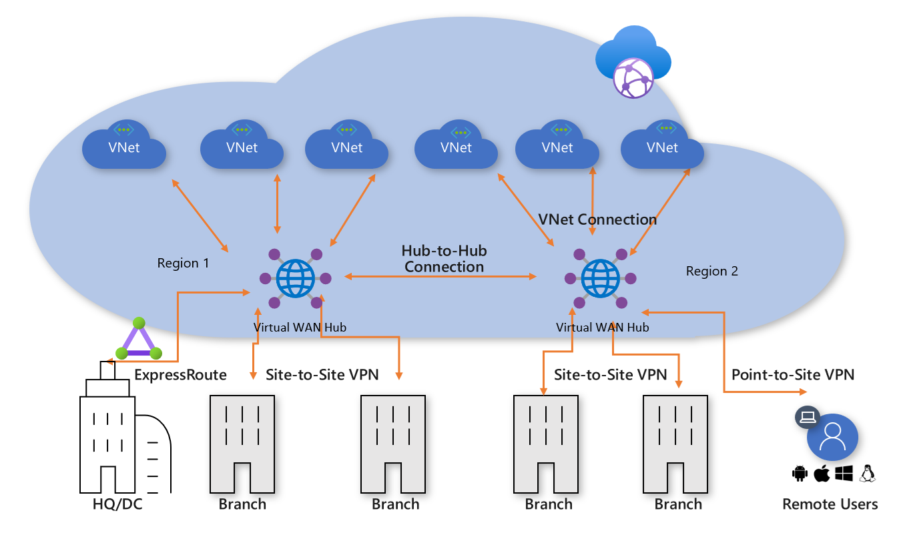
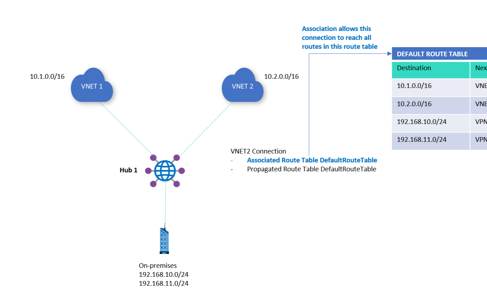
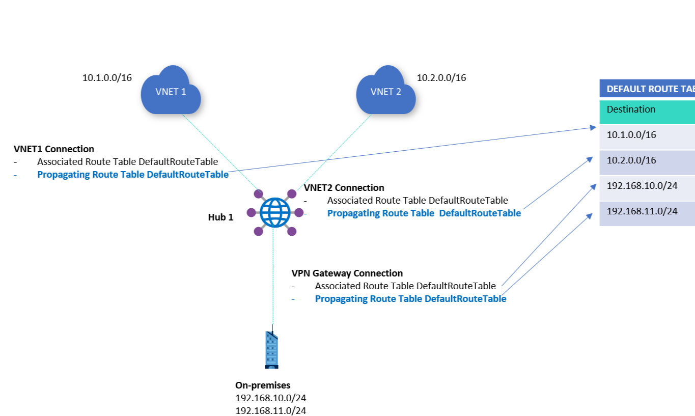

# Azure Virtual WAN

Historically, organizations used a combination of VPNs to provide site-to-site connections for branch offices, point-to-site connections for individual remote users, and connections to Cloud services.

Azure Virtual WAN combines all these methods of connectivity to enable the organization to leverage the Microsoft backbone network, which connects Microsoft data centers across Azure regions and a large mesh of edge-nodes around the world.

A secured virtual hub is an Azure Virtual WAN Hub with associated security and routing policies configured by Azure Firewall Manager. Use secured virtual hubs to easily create hub-and-spoke and transitive architectures with native security services for traffic governance and protection. You can use a secured virtual hub to filter traffic between virtual networks (V2V), virtual networks and branch offices (B2V) and traffic to the Internet (B2I/V2I). A secured virtual hub provides automated routing. *There's no need to configure your own UDRs (user defined routes) to route traffic through your firewall.*

#### Gateway scale

Planning for aggregate capacity of the Azure VPN gateway should be done after assessing the capacity needed to support the number of branches to the hub.

| Virtual WAN type | Hub type | Available configurations |
|------------------|----------|--------------------------|
| Basic	| Basic	| Site-to-site VPN only |
| Standard | Standard | ExpressRoute   User VPN (P2S)   VPN (site-to-site)   Inter-hub and VNet-to-VNet transiting through the virtual hub |

#### Hub private address space
**The minimum address space is /24 to create a hub.** If you use anything in the range from /25 to /32, it will produce an error during creation.

#### Connect cross-tenant VNets to a Virtual WAN hub

Before you can connect a cross-tenant VNet to a Virtual WAN hub, you must have the following configuration already set up:

* A Virtual WAN and virtual hub in the parent subscription.

* A virtual network configured in a subscription in the remote tenant.

* Non-overlapping address spaces in the remote tenant and address spaces within any other VNets already connected to the parent virtual hub.

#### Assign permissions

For the parent subscription with the virtual hub to modify and access the virtual networks in the remote tenant, you need to assign **Contributor permissions** to your parent subscription from the remote tenant subscription.

#### Associations

Each connection is associated to one route table. **Associating a connection to a route table allows the traffic to be sent to the destinations indicated as routes in the route table.** The routing configuration of the connection will show the associated route table. Multiple connections can be associated to the same route table. All VPN, ExpressRoute, and User VPN connections are associated to the same (default) route table.

#### Propagation

**Connections dynamically propagate routes to a route table.** With a VPN connection, ExpressRoute connection, or P2S configuration connection, routes are propagated from the virtual hub to the on-premises router using **BGP**. Routes can be propagated to one or multiple route tables.

## Network virtual appliance (NVA) in a virtual hub

**One of the benefits of Azure Virtual WAN** is the ability to support reliable connections from many different technologies, whether Microsoft based, such as **ExpressRoute** or a **VPN Gateway**, or from a networking partner, such as **Barracuda** CloudGen WAN, **Cisco** Cloud OnRamp for Multi-Cloud, and **VMware** SD-WAN. These types of devices are known as **network virtual appliances (NVAs)**; they are deployed directly into a Virtual WAN hub and have an **externally facing public IP address**. 

#### Deploy an NVA in your Virtual Hub

When you create an NVA in the Virtual WAN hub, like all Managed Applications, there will be two Resource Groups created in your subscription.

* **Customer Resource Group** - This will contain an application placeholder for the Managed Application. Partners can **use this to expose whatever customer properties they choose** here.

* **Managed Resource Group** - Customers cannot configure or change resources in this resource group directly, as this is **controlled by the publisher of the Managed Application.** This Resource Group will contain the NetworkVirtualAppliances resource.
